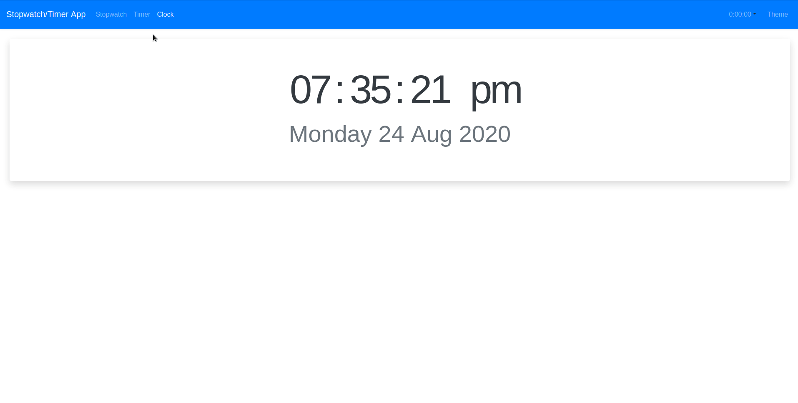

### React Stopwatch Timer App
---
A stopwatch timer app created with React. This app contains a stopwatch, timer, and clock page.
A live version of this app is available [here](https://nroboto-stopwatch-timer.herokuapp.com/).



This project uses react-router for routing and day.js for handling times and dates. Bootstrap/reactstrap is used for responsive design.

## Running
Install using
```
npm install
```
Run the development server with 
```
npm start
```
Run tests with
```
npm test
```
